```mermaid
graph TD
    A[GitHub Push] -->|Webhook Trigger| B[AWS CodeBuild]
    B -->|Read| C[buildspec.yaml]
    C -->|Install| D[Python, MCP, Terraform]
    D -->|Natural Language| E[Amazon Bedrock Nova]
    E -->|Generate| F[Terraform HCL Code]
    F -->|Validate| G[Terraform MCP Server]
    G -->|Init & Plan| H[Terraform State]
    H -->|Apply| I[AWS Resources Created]
    I -->|S3, EC2, Lambda, etc| J[Your AWS Account]
    
    style A fill:#ff9900
    style E fill:#00a1c9
    style I fill:#232f3e
    style J fill:#569a31
```

# 🚀 Natural Language Infrastructure Automation with AWS MCP

Deploy AWS infrastructure using plain English and AI-powered Terraform generation via AWS CodeBuild and MCP (Model Context Protocol).

## 🎯 What This Does

Describe your AWS infrastructure in natural language → AI generates Terraform → Automatically deploys to AWS.

## 🏗️ Architecture Flow



## ⚡ Quick Start

### 1. Prerequisites

- AWS Account with CodeBuild access
- GitHub repository
- Bedrock model access (Amazon Nova Pro)

### 2. Setup CodeBuild

Deploy the CloudFormation stack:

```bash
aws cloudformation deploy \
  --template-file codebuild-template.yaml \
  --stack-name mcp-infrastructure-builder \
  --capabilities CAPABILITY_NAMED_IAM
```

### 3. Configure Webhook

Connect GitHub to CodeBuild (one-time setup):
- Go to CodeBuild Console → Your Project
- Edit → Source → Connect to GitHub
- Authorize AWS CodeBuild

### 4. Use It!

Edit `buildspec.yaml` and change the instruction:

```yaml
INSTRUCTION: "Create an S3 bucket named my-app-logs with versioning and encryption"
```

Push to GitHub → Infrastructure automatically deploys! ✨

## 📝 Example Instructions

### S3 Bucket
```yaml
INSTRUCTION: "Create an S3 bucket named my-data-bucket with versioning enabled and block all public access"
```

### EC2 Instance
```yaml
INSTRUCTION: "Create a t3.micro EC2 instance named web-server with Amazon Linux 2023 and allow SSH access"
```

### Lambda Function
```yaml
INSTRUCTION: "Create a Python Lambda function named data-processor with 512MB memory"
```

### RDS Database
```yaml
INSTRUCTION: "Create a PostgreSQL RDS instance named app-db with db.t3.micro size and automated backups"
```

### Complete Stack
```yaml
INSTRUCTION: "Create an Application Load Balancer with Auto Scaling Group of 2-5 t3.small instances and RDS MySQL"
```

## 🛠️ How It Works

1. **Push Code**: Commit changes to GitHub
2. **Webhook Triggers**: CodeBuild starts automatically
3. **AI Generation**: Bedrock Nova generates Terraform code
4. **MCP Validation**: Terraform MCP Server validates configuration
5. **Auto Deploy**: Terraform applies changes to AWS
6. **Resources Created**: Your infrastructure is live!

## 🔧 Configuration

### Change Model

Edit `buildspec.yaml`:

```yaml
# Amazon Nova Pro (Default)
BEDROCK_MODEL_ID: "amazon.nova-pro-v1:0"

# Or use Claude (if quota available)
BEDROCK_MODEL_ID: "us.anthropic.claude-3-7-sonnet-20250219-v1:0"

# Or Amazon Titan
BEDROCK_MODEL_ID: "amazon.titan-text-premier-v1:0"
```

### Change Region

```yaml
AWS_REGION: "us-west-2"  # Default is us-east-1
```

## 📊 What Gets Created

- ✅ Terraform configuration files (`main.tf`)
- ✅ Terraform state files
- ✅ Real AWS resources (S3, EC2, Lambda, etc.)
- ✅ Build artifacts in S3

## ⚠️ Important Notes

- **Auto-Apply**: Infrastructure deploys automatically (no manual approval)
- **Real Resources**: Creates actual AWS resources that may incur costs
- **State Management**: Terraform state stored locally (consider S3 backend for production)
- **Security**: Review generated Terraform before production use

## 🎓 Features

- 🤖 **AI-Powered**: Natural language to infrastructure
- 🔄 **GitOps**: Push to deploy workflow
- ✅ **Validated**: MCP ensures Terraform correctness
- 🔐 **Secure**: Uses AWS IAM and best practices
- 📦 **Artifacts**: Saves all generated files

## 🔍 Monitoring

Check build status:

```bash
# List builds
aws codebuild list-builds-for-project \
  --project-name mcp-infrastructure-builder

# View logs
aws logs tail /aws/codebuild/mcp-infrastructure-builder --follow
```

## 🧹 Cleanup

Destroy created resources:

```bash
cd tfgen
terraform destroy -auto-approve
```

Delete CloudFormation stack:

```bash
aws cloudformation delete-stack --stack-name mcp-infrastructure-builder
```

## 📚 Tech Stack

- **AWS CodeBuild**: CI/CD automation
- **Amazon Bedrock**: AI model inference (Nova Pro)
- **MCP**: Model Context Protocol for Terraform
- **Terraform**: Infrastructure as Code
- **Python**: Orchestration logic

## 🤝 Contributing

Contributions welcome! This project demonstrates:
- Natural language infrastructure
- MCP integration patterns
- AI-powered DevOps workflows

## 📄 License

MIT License - Use freely for learning and production!

---

**Built with ❤️ using AWS MCP Server and Amazon Bedrock**